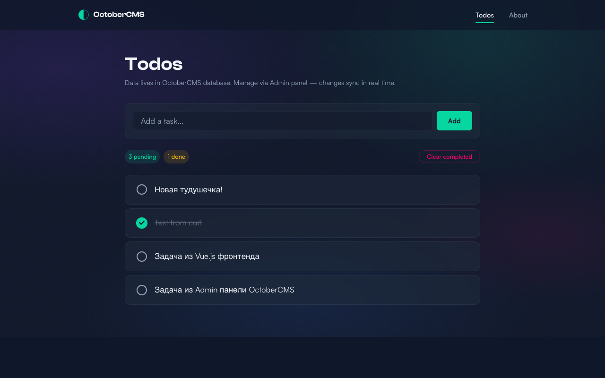
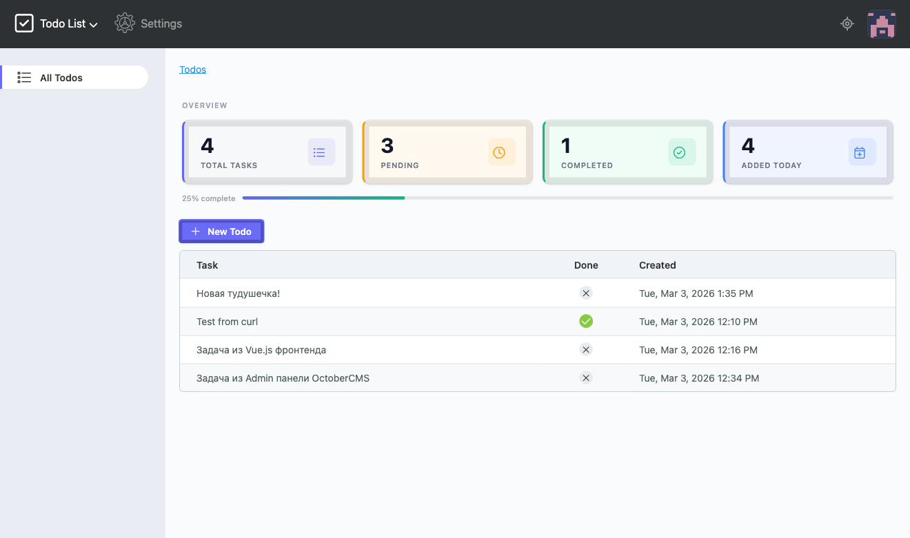
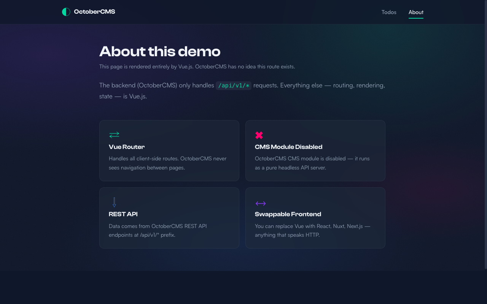

# OctoberCMS Headless + Vue.js Demo

> OctoberCMS без CMS-модуля как чистый API backend, Vue.js 3 SPA с Aurora-темой как фронтенд.

## Screenshots

**Vue.js Frontend — Todo List (Aurora Theme)**


**OctoberCMS Admin Panel — Dashboard & CRUD**


**Vue.js Frontend — About Page**


---

## Суть

OctoberCMS — это не только CMS с Twig-шаблонами. Это **Laravel-фреймворк** с удобной экосистемой плагинов. CMS-модуль (страницы, шаблоны, медиа) — **опциональный компонент**, который можно отключить одной строкой.

После отключения:
- OctoberCMS = чистый Laravel API backend
- Фронт — **любой**: Vue.js, React, Next.js, Nuxt.js, мобильное приложение
- Данные — через REST API
- Admin-панель OctoberCMS работает как обычно для управления данными

## Что есть в этом репо

```
october-headless-demo/
├── backend/                              # OctoberCMS (Laravel)
│   ├── composer.json                     # Зависимости PHP
│   ├── .env.example                      # Конфиг (скопировать в .env)
│   ├── config/
│   │   └── cms.php                       # CMS_DISABLE_MODULE=true
│   └── plugins/demo/api/
│       ├── Plugin.php                    # CORS + навигация в Admin
│       ├── routes.php                    # API роуты (/api/v1/*)
│       ├── models/
│       │   └── Todo.php                  # Модель с Sortable trait
│       ├── http/controllers/
│       │   └── TodoController.php        # CRUD /api/v1/todos
│       ├── controllers/
│       │   └── Todos.php                 # Admin контроллер + stats dashboard
│       │   └── todos/
│       │       ├── index.php             # Список + панель статистики
│       │       ├── create.php            # Форма создания
│       │       ├── update.php            # Форма редактирования
│       │       ├── config_list.yaml      # Конфиг списка + reorder
│       │       └── config_form.yaml      # Конфиг формы
│       └── updates/
│           ├── version.yaml
│           └── create_todos_table.php
├── frontend/                             # Vue.js 3 SPA
│   ├── package.json                      # Зависимости npm
│   ├── vite.config.js                    # Vite + proxy на backend
│   ├── index.html                        # Fontshare fonts (Clash Display + Satoshi)
│   └── src/
│       ├── main.js
│       ├── App.vue                       # Layout + page transitions
│       ├── router/index.js               # Vue Router
│       ├── api/client.js                 # Axios → OctoberCMS API
│       ├── stores/todos.js               # Pinia store (API + localStorage)
│       ├── assets/styles/
│       │   ├── variables.css             # Design tokens (Aurora palette)
│       │   ├── global.css                # Reset, glassmorphism, grain texture
│       │   └── transitions.css           # Vue Router page transitions
│       ├── components/
│       │   └── AppNavbar.vue             # Sticky glassmorphism navbar
│       └── views/
│           ├── TodoView.vue              # / — Todo list (CRUD)
│           ├── AboutView.vue             # /about — Architecture overview
│           └── NotFoundView.vue          # 404 — Gradient text
└── docs/
    └── screenshots/                      # Скриншоты для README
```

## Архитектура

```
┌─────────────────────────┐     GET /api/v1/todos     ┌──────────────────────────┐
│     Vue.js Frontend     │ ◄───────────────────────► │   OctoberCMS Backend     │
│   localhost:5173        │                            │   localhost:8000          │
│                         │                            │                          │
│  Vue Router (SPA)       │                            │  CMS Module: DISABLED ✗  │
│  /         → TodoView   │                            │  API Routes: ENABLED  ✓  │
│  /about    → AboutView  │                            │  Admin Panel: /admin     │
│                         │                            │  Database: SQLite/MySQL  │
│  Aurora Theme           │                            │  Stats Dashboard         │
│  Glassmorphism + Grain  │                            │  Drag & Drop Reorder     │
└─────────────────────────┘                            └──────────────────────────┘
```

## Фичи

| Фича | Описание |
|------|----------|
| **Headless CMS** | CMS-модуль отключён одной строкой, OctoberCMS = чистый Laravel API |
| **Aurora Theme** | Тёмная тема с градиентным фоном, glassmorphism-карточки, grain texture |
| **Stats Dashboard** | Панель статистики в админке: Total / Pending / Completed / Added Today |
| **Drag & Drop Reorder** | Сортировка задач перетаскиванием в Admin (Sortable trait) |
| **Page Transitions** | Плавные переходы между страницами (Vue Router transitions) |
| **Real-time Sync** | Создай задачу в Admin — она сразу видна во Vue, и наоборот |

## Установка и запуск

### 1. Backend (OctoberCMS)

```bash
cd backend

# Установить зависимости
composer install

# Скопировать конфиг
cp .env.example .env

# Сгенерировать ключ приложения
php artisan key:generate

# Создать SQLite базу (или настроить MySQL в .env)
touch database/database.sqlite

# Запустить миграции и установку
php artisan october:up

# Запустить сервер
php artisan serve
# → http://localhost:8000
```

Войти в Admin: `http://localhost:8000/admin`
Логин: `admin` / Пароль: задаётся при `october:up`

### 2. Frontend (Vue.js)

```bash
cd frontend

# Установить зависимости
npm install

# Запустить dev-сервер
npm run dev
# → http://localhost:5173
```

### 3. Проверить что работает

```bash
# API backend
curl http://localhost:8000/api/v1/health
# → {"status":"ok","cms_module":"disabled","message":"OctoberCMS headless API is running!"}

# Todos API
curl http://localhost:8000/api/v1/todos
# → {"data":[...]}
```

## API Endpoints

| Method | URL | Описание |
|--------|-----|----------|
| GET | `/api/v1/health` | Проверка работы API |
| GET | `/api/v1/todos` | Список задач |
| POST | `/api/v1/todos` | Создать задачу |
| PUT | `/api/v1/todos/:id` | Обновить задачу |
| DELETE | `/api/v1/todos/:id` | Удалить задачу |

## Ключевой момент — одна строка отключает CMS

**`backend/config/cms.php`**:
```php
'disableCmsModule' => env('CMS_DISABLE_MODULE', true),
```

**`backend/.env`**:
```
CMS_DISABLE_MODULE=true
```

Всё. После этого OctoberCMS не обрабатывает ни один URL через свои шаблоны. Все маршруты — через стандартный Laravel Router в `routes.php` плагина.

## Демо: Admin → Vue.js синхронизация

1. Открываем Admin: `http://localhost:8000/admin`
2. Переходим в **Todo List** (в меню слева)
3. Создаём задачу
4. Открываем Vue фронт: `http://localhost:5173`
5. Видим только что созданную задачу — **без перезагрузки страницы**

И наоборот — добавляем задачу в Vue, она появляется в Admin.

## Можно использовать любой фронт

OctoberCMS как backend — это просто Laravel API. Клиент может быть любым:

| Frontend | Поддержка |
|----------|-----------|
| Vue.js | ✅ (этот пример) |
| React | ✅ |
| Next.js | ✅ |
| Nuxt.js | ✅ |
| Mobile (iOS/Android) | ✅ |
| Postman / curl | ✅ |

---

*Demo by [Clawdia](https://t.me/ghostinthemachine_ai) for [Fruskate](https://t.me/fruskate)*
